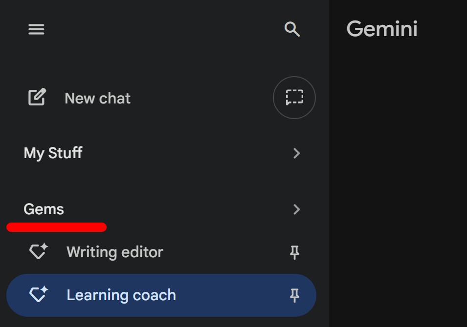
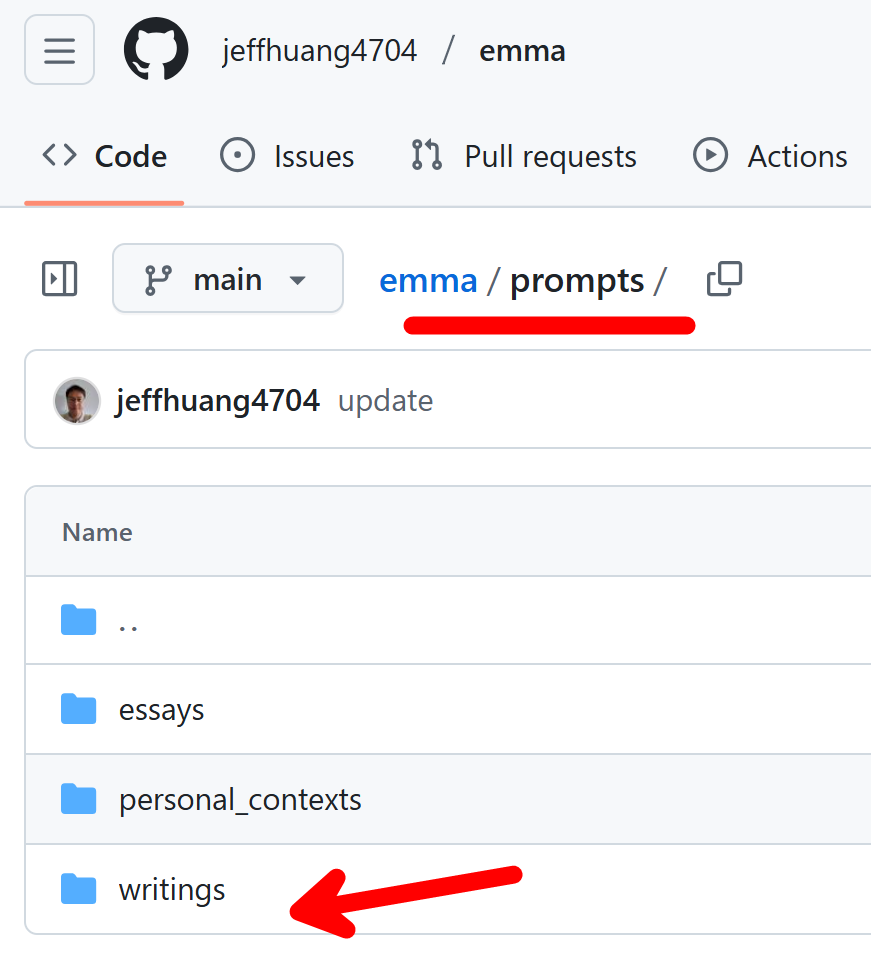
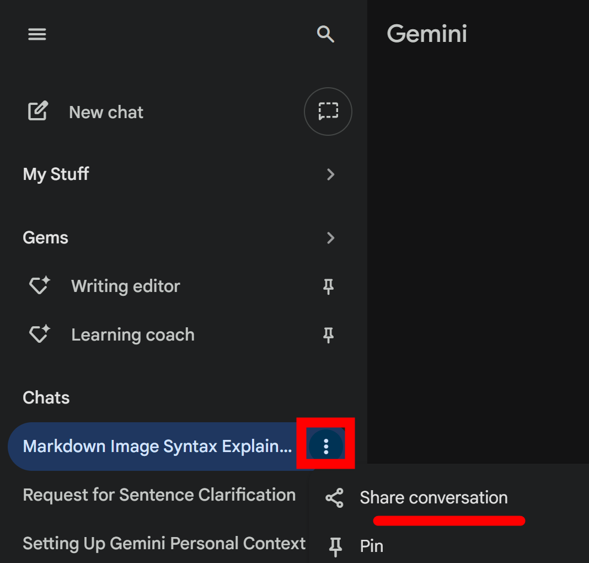

# emma

### Setup Personal Context

Refer to the [doc](./prompts/personal_contexts/README.md)

### Use Gemini Gems

- Writing editor
- Learning coach

  

### Use prompts to help you review essays

Refer to the [prompts](./prompts)

  

### Share chat history

  

