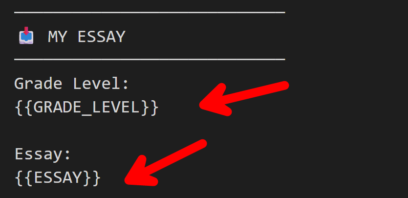

## Using prompts

Currently, there are two types of prompts:

- `structure`: Focuses on essay structure and organization.  
- `general`: Focuses on grammar and spelling, and also provides a revised version of the essay.  

For each type, there is also a -student version, which offers the same functionality but presents feedback in a simpler, more student-friendly format.

### Steps

1. Select the prompt.
2. Copy the prompt into a text editor.
3. Paste your essay into the designated section of the prompt.
4. Copy the completed prompt and submit it to Gemini or ChatGPT.

  

